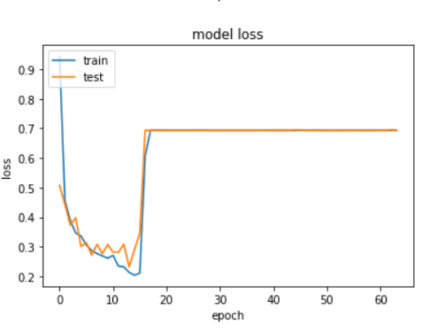
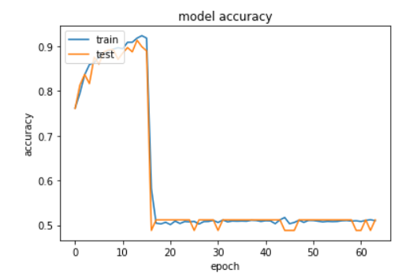
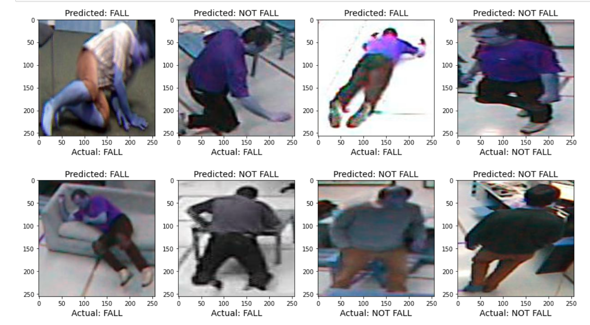

# Fall Detection with CNN Architecture

According to the World Health Organization (WHO), each year 646 000 fatal fall occurs around the world and most of the people who are injured are over 65 ([WHO, 2018](https://www.who.int/news-room/fact-sheets/detail/falls)). Therefore it is vital to detect falling immediately so that they can recieve first aid and be taken to the hospital, otherwise it can be deadly, especially for senior citizens. There are different methods to identify whether a person is falling. For example devices that are wearable on wrist or waist that use accelerometer to detect falling. In this project, I will use Convolutional Neural Network architecture to detect whether a person has fallen/falling or standing. 

---
## Table of Contents
- [Requirements](#requirements)
- [How to Run](#how-to-run)
- [Data](#data)
- [CNN Architecture](#cnn-architecture)
- [Motivation](#motivation)
---

## Requirements
This project requires [Python3.8](https://www.python.org/downloads/release/python-380/) and the following Python libraries installed:
- [NumPy](https://numpy.org/)
- [pandas](https://pandas.pydata.org/)
- [matplotlib](https://matplotlib.org/)
- [tensorflow](https://www.tensorflow.org/)
- [opencv](https://opencv.org/)

Instead of manually installing the libraries, you can install all of them with `requirements.txt`. Here is how it works:<br />
```bash
pip install -r requirements.txt
```
Since all the code has been written in [Jupyter Notebook](http://jupyter.org/install.html), you also need that to be installed on your computer.
If you do not have Python installed yet, you can install the [Anaconda](https://www.anaconda.com/download/) distribution of Python, which is already coming with NumPy and Matplotlib installed.
If you do not have pip installed, you can run the code below in the terminal or command window
- For Linux / MacOS
```bash
python get-pip.py
```
- For Windows
```bash
C:> py get-pip.py
```
## How to Run
After installing all the libraries properly, open the folder containing `Fall Detection.ipynb` in the terminal or command window. Then run this code:
```bash
ipython notebook 'Fall Detection.ipynb'
```  
or
```bash
jupyter notebook 'Fall Detection.ipynb'
```
## Data
I am using all the publicly available dataset,which are mostly videos. Then those videos are broken into images of size 256x256, each corresponding to one frame. Images have been labelled manually into fall and not fall.The falling dataset is still less so color augmnetation technique used to balance both fall and not fall classes.

## CNN Architecture
We have 6 blocks for feature extraction followed by a header. Each block contains Conv2D Layer with ReLU activation and MaxPooling2D. We start with 16 units and increase by 2 after 2 block:
<div align='center'>16 -> 16 -> 32 -> 32 -> 64 -> 64 <br />
<div align='left'> After feature extraction, we flatten the result, add Dense layer with 32 units and use sigmoid activation for classification. Here is the visual interpretation of our CNN architecture:
<p align="center">
  
</p>

## Losses
 
  
## Accuracy
 
  
## Results
 
